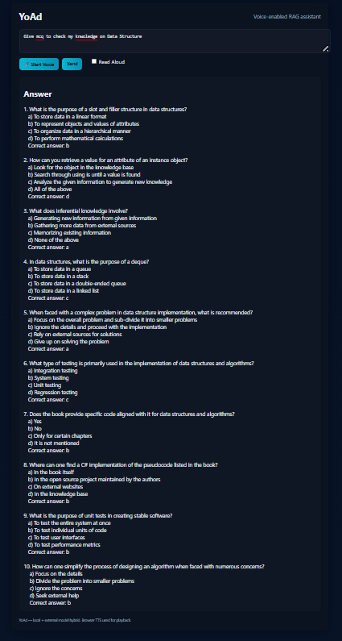

# YoAd: Voice-Enabled RAG AI Assistant (Web & CLI)

YoAd is a Retrieval-Augmented Generation (RAG) assistant with:
- **Web UI** (Flask, browser voice input/output)
- **Voice-enabled CLI** (speech recognition & TTS)
- **Hybrid LLM**: Local (Ollama/HF) + OpenAI fallback
- **MCQ/Quiz Generation** for self-testing

Ask questions, generate quizzes, or interact with your own documents—via browser or terminal!


## Project Structure

```
├── data/               # Store your custom documents here
├── ingestion.py        # Data ingestion pipeline
├── jarvis_app.py       # Main RAG application (CLI)
├── jarvis_app_voice.py # Voice-enabled CLI assistant
├── web_ui.py           # Flask web server (browser UI)
├── requirements.txt    # Project dependencies
├── .env                # Environment variables
├── static/             # Web UI static files (css/js)
├── templates/          # Web UI HTML templates
```


## Setup & Usage

1. **Install dependencies:**
	```bash
	pip install -r requirements.txt
	```

2. **(Optional) Install Ollama & Llama2 for local LLM:**
	```bash
	# https://ollama.ai/ (for local LLM)
	ollama pull llama2
	```

3. **Configure environment variables:**
	- Copy `.env.example` to `.env` (or create `.env`)
	- Add your Pinecone API key, environment, and (optional) OpenAI API key:
	  ```env
	  PINECONE_API_KEY=...
	  PINECONE_ENVIRONMENT=...
	  EXTERNAL_LLM_PROVIDER=openai
	  OPENAI_API_KEY=sk-...
	  EXTERNAL_MODE=kb_then_external
	  ```

4. **Prepare your data:**
	- Place PDFs, DOCX, PPTX, TXT, or MD files in `data/`

5. **Ingest your data:**
	```bash
	python ingestion.py
	```

6. **Run the Web App (recommended):**
	```bash
	python web_ui.py
	# Visit http://127.0.0.1:5000 in your browser
	```

7. **Or use the Voice CLI:**
	```bash
	python jarvis_app_voice.py
	```


## Features

- **Web UI**: Modern browser interface, voice input/output, dark mode
- **Voice CLI**: Speak or type questions, get spoken answers
- **Hybrid LLM**: Uses local Ollama (if available), falls back to OpenAI (if configured)
- **MCQ/Quiz Generation**: Ask for "MCQs on X" or "Quiz me on Y"—get instant multiple-choice questions
- **Retrieval-Augmented**: Answers use your own documents (PDF, DOCX, PPTX, TXT, MD)
- **OpenAI fallback**: If your KB doesn't have the answer, OpenAI (GPT-3.5/4) is used (if API key set)


## Example Queries

- "Give 10 MCQs to check my knowledge on machine learning"
- "Quiz me on Deep Learning"
- "What is backpropagation?"
- "Summarize the main points of this document"


## Screenshots

You can showcase the web UI and features here. To add a screenshot:

1. Take a screenshot of the app (e.g., web UI, MCQ generation, voice controls).
2. Save it in the repo (e.g., in a `screenshots/` folder or upload via GitHub UI).
3. Embed it in this section using Markdown:


### Example: ML Feature


### Example: MCQ Generation

---

**GitHub:** [YoAd-Education-AI-Assistant-](https://github.com/manisharya490/YoAd-Education-AI-Assistant-)